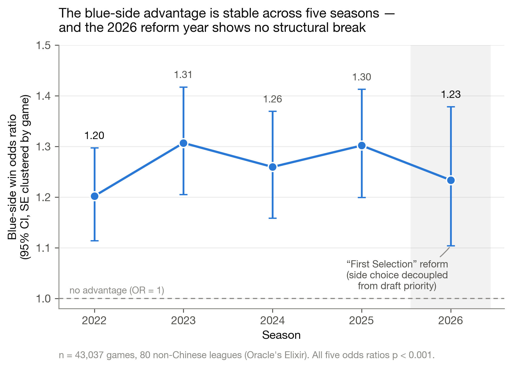
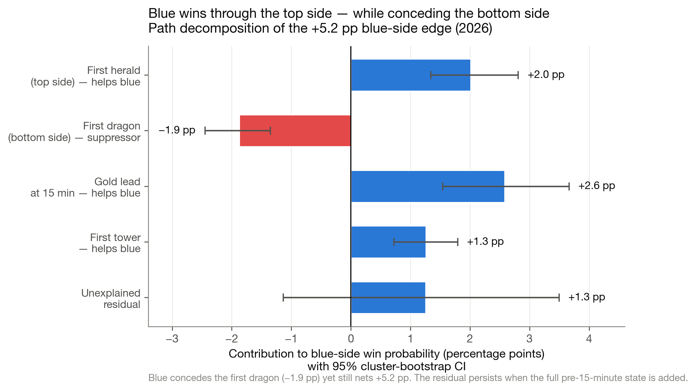

# Why Does Blue Side Win More Often?

### Separating map position from draft priority and tracing the early-game economy in professional *League of Legends*

[](https://www.python.org/)
[](LICENSE)
[](https://oracleselixir.com/)

This repository contains a reproducible analysis of **43,037 professional games**
(86,074 team-games) from **80 non-Chinese league labels**, covering 2022 through
2 June 2026. It studies a persistent competitive imbalance: blue-side teams win
more often than red-side teams.

The central challenge is identification. Before 2026, blue side was almost always
bundled with first-pick priority. Riot Games' 2026 **First Selection** rule created
the first large sample in this dataset in which first pick could occur on red side.
That variation makes map side and draft priority empirically distinguishable—although
not randomly assigned—and allows the analysis to trace the observed blue-side gap
through early objectives, 15-minute gold, and match outcome.

> **Main finding.** The win association follows **map side** more closely than
> first-pick priority. Blue side is associated with greater top-side objective control,
> more first towers, and a **549-gold average lead at 15 minutes**. Teams ahead at
> 15 minutes win **73.96%** of games. These are observational associations, not a
> claim that one objective or map position causally determines the result.

<details>
<summary><strong>中文摘要</strong></summary>

本仓库使用 Oracle's Elixir 的 2022–2026 年职业比赛数据，研究蓝方胜率为什么持续
高于红方。最终样本包含 43,037 场比赛、86,074 个 team-game 和 80 个非中国赛区标签。

2026 年 First Selection 规则使地图方与一选权不再完全绑定。联合模型中，蓝方仍与
胜利显著相关，而一选权没有检测到独立关联；但一选权置信区间仍然较宽，因此不能断言
其价值为零。蓝方更常拿到首只峡谷先锋和一塔、更少拿到首条小龙，并在 15 分钟平均
领先 549 经济。整套分析强调相关性、稳健性和可复现性，不把路径分解解释为因果中介。

</details>

## Analysis overview

The analysis combines paired match data, statistical inference, and predictive
model comparisons:

- **Data preparation:** cleaning, paired team-game construction, draft-order features, and integrity checks.
- **Statistical analysis:** logistic regression, Elo controls, team fixed effects, clustered inference, and bootstrap decomposition.
- **Predictive evaluation:** Logistic Regression, Random Forest, and XGBoost with game-grouped and chronological validation.
- **Outputs:** an analysis-ready dataset, model tables, English figures, and manuscript-support materials.

For the research design, see [methods and interpretation](docs/METHODS.md) and
[current manuscript scope](docs/PAPER_STATUS.md). Start with [`run_all.py`](run_all.py)
to reproduce the analysis; [`audit_data.py`](src/audit_data.py) checks the data and
[`ml_validation.py`](src/ml_validation.py) compares predictive models.

---

## Research questions

1. Is the blue-side win advantage persistent across seasons?
2. Does the 2026 association follow map side or first-pick priority?
3. Does revealing a role later predict winning? (Historical supplementary analysis.)
4. Where does the side imbalance become visible in the early game?
5. How strongly does 15-minute gold order final win probability?
6. Did the 2026 rule change coincide with a structural break in the blue-side gap?

Counter-pick timing and equivalence analyses are retained as historical supplements.
They are outside the current manuscript scope because reveal order does not identify
actual counter-pick intent; see [PAPER_STATUS.md](docs/PAPER_STATUS.md).

## Headline results

| Result | Estimate | Interpretation |
|---|---:|---|
| Pooled blue-side win rate | **52.89%** | Blue won 22,764 of 43,037 games. |
| Blue-side win odds, 2022–2026 | **OR 1.20–1.31** each season | The association is positive in all five observed seasons. |
| Blue side in the 2026 joint model | **OR 1.269**, 95% CI [1.115, 1.443] | The side association remains after first-pick status is included. |
| First pick in the 2026 joint model | **OR 0.939**, 95% CI [0.825, 1.068] | No detectable independent association; the interval is too wide to establish practical equivalence. |
| Counter-pick timing, 5 roles × 2 seasons | **0/10** FDR-significant | All ten estimates are equivalent within a prespecified ±10% odds region. |
| First Herald difference | **+19.33 pp** for blue | The largest positive side difference in named objective ownership. |
| First Dragon difference | **−19.48 pp** for blue | Dragon control suppresses rather than explains the observed blue-side gap. |
| First Tower difference | **+8.70 pp** for blue | Consistent with stronger early economic conversion. |
| Gold difference at 15 minutes | **+549 gold** for blue | The side imbalance is clearly visible in the early economy. |
| Win rate when GD@15 > 0 | **73.96%** | Fifteen-minute gold strongly orders final match outcome. |
| Predictive model comparison | **AUC 0.833–0.834** across models | Flexible ML does not materially outperform the interpretable logistic benchmark on the current feature set. |

As a team-strength robustness check, the pooled linear-probability estimate changes
from **+5.79 percentage points** to **+5.49 points** with own-team-season fixed
effects and **+4.57 points** after opponent-team effects are added.

## Key figures

| Blue-side association by season | 2026 path decomposition |
|---|---|
|  |  |
| The blue-side odds ratio remains above one in every observed season. | Recent blue-side gaps combine positive Herald, tower, and gold channels with a negative Dragon channel. |

Additional English figures are available in [`figures/en/`](figures/en/): draft-lever
coefficient plots, equivalence tests, the supplementary reform event study, and the
out-of-sample ML validation figure `fig_en6_ml_validation.png`.

The predictive-check outputs are [`results/ml_model_comparison.csv`](results/ml_model_comparison.csv),
[`results/ml_fold_metrics.csv`](results/ml_fold_metrics.csv),
[`results/ml_feature_importance.csv`](results/ml_feature_importance.csv), and
[`figures/en/fig_en6_ml_validation.png`](figures/en/fig_en6_ml_validation.png).

## Quick start

中文运行与目录说明：[使用说明.md](使用说明.md)。
网页上传步骤：[上传到GitHub.md](上传到GitHub.md)。
Supplementary research scripts, report builders, and presentation source modules
are preserved in [`supplementary.zip`](supplementary.zip); see the
[extraction instructions](supplementary/README.md).


Python 3.10 or later is required; the release was tested with Python 3.13.
For the exact direct dependency versions used in that run, install
`requirements-tested.txt` instead of `requirements.txt`.

```bash
python -m venv .venv
source .venv/bin/activate
python -m pip install -r requirements.txt
python run_all.py
```

The committed analysis-ready table is losslessly compressed as
`data/derived/redblue_teamgames.csv.gz`; the pipeline reads it directly without
manual extraction. The default pipeline uses this table, runs the data-integrity
audit first, and then regenerates all statistical results and figures, including the
ML validation summary and English supplementary figure. Outputs are written to
[`results/`](results/) and [`figures/`](figures/).

On Windows PowerShell, activate the environment with:

```powershell
.venv\Scripts\Activate.ps1
```

### Rebuild from raw data

Raw Oracle's Elixir files are not redistributed in this repository. To reconstruct
the derived panel:

1. Download the 2022–2026 yearly CSV files from the
   [Oracle's Elixir downloads page](https://oracleselixir.com/tools/downloads).
2. Place them in [`data/raw/`](data/raw/) using the filenames documented in
   [`data/raw/README.md`](data/raw/README.md).
3. Run:

```bash
python run_all.py --from-raw
```

All stochastic procedures use fixed seeds.

### Verification

```bash
python -m unittest discover -s tests
python src/audit_data.py
python src/paper_claim_audit.py
```

## Data and study design

- **Source:** Oracle's Elixir professional match data.
- **Coverage:** 10 January 2022 to 2 June 2026; the 2026 season is partial.
- **Sample:** 43,037 games, 86,074 team-games, 80 distinct non-Chinese league labels.
- **Exclusions:** LPL and LDL are excluded because required early-game fields are
  largely missing in the source files. The Portuguese LPLOL is retained.
- **Unit of observation:** one team-game row; every match contributes a mirrored blue
  and red row.
- **Dependence:** standard errors are clustered by game where applicable.
- **Outcome:** match win/loss.
- **Main predictors:** side, first-pick status, role-level reveal order, early objective
  ownership, and gold/experience differences at 10 or 15 minutes.
- **Leakage control:** end-of-game totals are not used to explain pre-game or early-game
  mechanisms.

The integrity gate checks that every game has two teams, one winner and one loser,
one blue and one red side, and mirror-symmetric opponent-difference variables before
any model is estimated.

## Empirical strategy

| Question | Main method |
|---|---|
| Persistence of the side gap | Season-specific logistic regressions with game-clustered standard errors |
| Team-strength confounding | Pre-match Elo and pooled fixed-effects linear-probability models |
| Side versus first pick | 2026 joint logistic model using red-side first-pick variation |
| Counter-pick timing | Role-season logistic models, Benjamini–Hochberg FDR correction, and TOST equivalence tests |
| Match-up versus reveal timing | Cross-fitted, shrinkage-adjusted champion match-up score |
| Early-game pathway | Side-to-state regressions, GD@15 models, and additive path decomposition with game-cluster bootstrap intervals |
| 2026 reform check | League-season difference-in-differences/event-study diagnostic |
| Predictive model comparison | Grouped cross-validation and chronological holdouts comparing logistic regression, random forest, and XGBoost |

See [`docs/METHODS.md`](docs/METHODS.md) for the complete statistical rationale and
[`docs/report_bilingual.md`](docs/report_bilingual.md) for the longer bilingual report.
The literature-review search, screening, and extraction plan is documented in
[`docs/LITERATURE_REVIEW.md`](docs/LITERATURE_REVIEW.md), with a machine-readable
seed set in [`docs/literature_seed.csv`](docs/literature_seed.csv).

## Repository structure

```text
.
├── run_all.py                    # one-command reproduction pipeline
├── requirements.txt
├── data/
│   ├── raw/                      # raw yearly CSVs; not committed
│   └── derived/                  # committed analysis-ready tables
├── src/
│   ├── audit_data.py             # structural integrity checks
│   ├── build_dataset.py          # raw files -> team-game panel
│   ├── model_draft_value.py      # side, first-pick, and counter-pick models
│   ├── team_strength.py          # Elo robustness analysis
│   ├── fixed_effects_controls.py # pooled team/opponent fixed-effects models
│   ├── mediation_path.py         # additive path decomposition + bootstrap
│   ├── mediation_full.py         # expanded early-state residual analysis
│   ├── matchup_quality.py        # cross-fitted match-up quality model
│   ├── equivalence_tost.py       # practical-equivalence tests
│   ├── ml_validation.py          # grouped-CV and chronological predictive checks
│   ├── did_first_selection.py    # supplementary reform diagnostic
│   ├── robustness.py             # subset and heterogeneity checks
│   ├── paper_tables.py           # manuscript-support tables
│   ├── paper_claim_audit.py      # repo-claim consistency audit
│   ├── figures.py                # main analysis figures
│   ├── figures_paper_en.py       # English paper figures
│   └── runtime.py                # runtime helpers for local reproducibility
├── supplementary.zip             # complete related research and presentation sources
├── supplementary/README.md       # archive extraction and usage instructions
├── tests/                        # lightweight repo-health regression tests
├── .github/workflows/ci.yml      # dependency install, tests, data + claim audits
├── results/                      # model tables and readable logs
├── figures/                      # generated figures; English set in figures/en/
└── docs/
    ├── METHODS.md
    ├── LITERATURE_REVIEW.md
    ├── literature_seed.csv
    └── report_bilingual.md
```

## Interpretation boundaries

The findings have the following limitations:

- **Observational design:** side and first-pick allocation are not randomized.
- **First-pick uncertainty:** a non-significant coefficient is not proof of zero value;
  its equivalence test does not pass the prespecified ±10% odds region.
- **Objective timing:** the source identifies first-objective ownership but does not
  timestamp first Herald, Dragon, tower, or blood in the files used here. Their
  relationship with GD@15 is therefore descriptive, not a verified pre-15 causal effect.
- **Path decomposition:** the components are associational and depend on the included
  channels; they are not causal mediation estimates.
- **Reform analysis:** pre-reform trends are not sufficiently flat for a causal
  difference-in-differences interpretation. The event study is supplementary evidence.
- **Unmeasured mechanisms:** the residual is compatible with spatial mechanisms, but it
  does not by itself prove that camera angle or map geometry is the root cause.
- **Generalizability:** the sample excludes Chinese professional leagues and ends early
  in the 2026 season.

## Citation

If you use this repository, please cite:

```bibtex
@misc{feng2026blueside,
  title  = {Why Does Blue Side Win More Often? Separating Map Position from
            Draft Priority and Tracing the Early-Game Economy in Professional
            League of Legends},
  author = {Feng, Vincent},
  year   = {2026},
  note   = {Reproducible analysis of Oracle's Elixir professional match data,
            2022--2026}
}
```

## License and data attribution

Code is released under the [MIT License](LICENSE). Oracle's Elixir match data remain
subject to their original terms; raw files are not redistributed here.

---

**Author:** Vincent Feng · Independent research project, 2026

See [current manuscript scope and audit coverage](docs/PAPER_STATUS.md) before using
repository outputs in the paper. The fixed-effects audit checks all three displayed
estimates against the results CSV.
