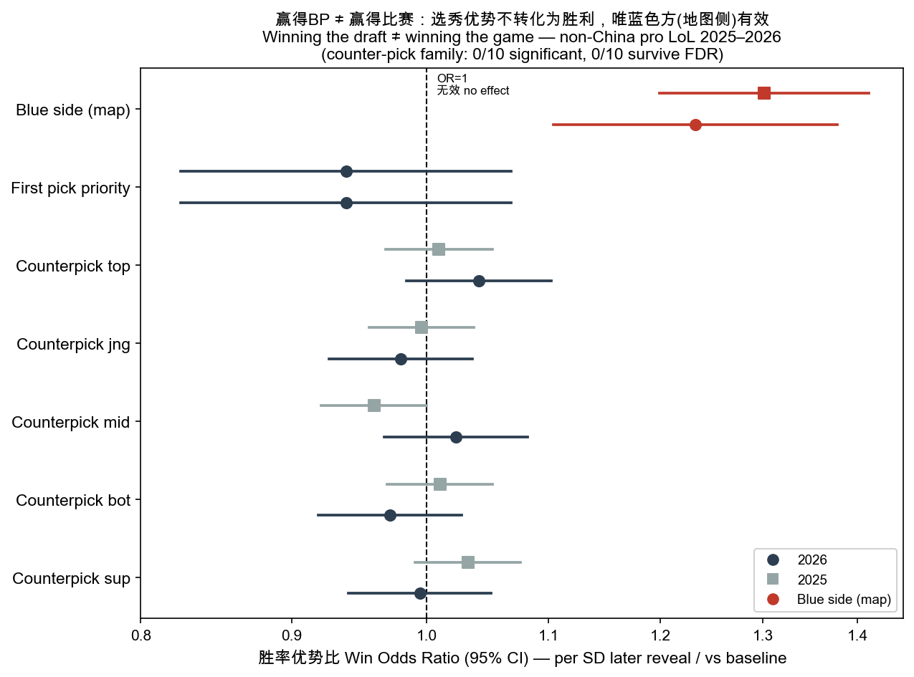

> Historical research narrative. For the current analysis scope and interpretation limits, see [README.md](../README.md) and [PAPER_STATUS.md](PAPER_STATUS.md).

# 红蓝方与选秀优势的迷思
## The Myth of Draft Advantage: Statistically Disentangling Map-Side from Draft in Professional League of Legends

> 📦 **Repo note.** This is the full bilingual narrative. The causal-inference steps it
> lists as *pending* (mediation with CIs, a First-Selection DiD, a team-strength control,
> FDR correction) are now **implemented** in this repository — see
> [`../README.md`](../README.md), [`METHODS.md`](METHODS.md), and `../src/*.py`. Script /
> data paths in the Appendix below refer to the original monorepo; the equivalents here are
> `src/model_draft_value.py`, `src/team_strength.py`, `src/mediation_path.py`,
> `src/did_first_selection.py`, and `src/robustness.py`.

> **数据 / Data**：Oracle's Elixir 职业比赛数据，非中国赛区。主样本《2026年非中国赛区比赛数据.csv》（5,000 局 / 10,000 队伍-局 / 35 赛区 / 补丁 16.01–16.10）；机制复现样本：2022–2025 各年原始数据（手动剔除 LPL/LDL 后，每年约 8,600–10,400 非中国局）。
> **分析单位 / Unit**：每队每局一行（`result`＝是否获胜）；所有标准误按 `gameid` 聚类（处理同局两行镜像）。
> **预测变量原则 / Predictor rule**：胜负模型只用**选秀阶段 + ≤15 分钟**信息，严格避免赛后变量造成循环解释。
> **状态 / Status**：选题 + 初步验证（pilot）已完成；本报告同时充当**开题报告骨架**。所有数字均已实证跑出；核心机制已做 **2022–2026 五个赛季复现**（见 §5.4）。
> **2026-07 更新 / July 2026 update**：**因果推断扩展已完成**——有序中介升级为**路径分析＋整簇 bootstrap 置信区间**（§5.5）、新增 **Elo 实力控制**（§5.6）、**DiD 事件研究评估 First Selection 新规**（§5.7）、**内部对位质量控制＋TOST 等价检验**（§5.8）、counterpick 家族 **FDR 校正**、以及**数据完整性审计**（剔除 2 场重赛废局，n=84,548 队伍-局）。全部打包为可复现仓库 `map-side-vs-draft/`（`python run_all.py` 一键复现）；方法适用性评估（为何不用完整 SEM/IV/RDD 等）见 `map-side-vs-draft/docs/METHODS.md`。

---

## 0. 摘要 · Abstract

职业 League of Legends 的解说、教练与观众普遍相信选秀（BP）阶段的两类"优势"能带来胜利：**首选权**（先选、抢 OP 英雄）与**后手反制选英雄**（counterpick，拿到信息后针对性选）。本研究用非中国赛区 2025–2026 的 Oracle's Elixir 数据，将"地图侧（红/蓝方）优势"与"选秀优势"**首次在统计上分离**，得到三个互相印证的结论：(1) **后手 counterpick 在五条路、两个赛季均不带来胜率优势**（优势比 OR 全部落在 0.96–1.04，无一显著）；(2) **首选权也无独立胜率价值**（OR≈0.94，不显著）；(3) **蓝色方优势真实存在且跨年稳健**（OR≈1.23–1.31，p<0.001），但**它并不来自选秀**。本研究恰逢 Riot 于 2026 年推出 **First Selection** 规则（将"选边"与"先后手"解绑）——这既解释了数据中的关键变异，也使本课题成为对该规则的一次及时评估。

**进一步（2022–2026 五年一致）**：蓝色方优势来自**上半区早期资源**（首先锋每年多 15–25pp）＋结构性早期经济领先（15 分钟每年领先约 450–670 金），而**非控龙**（红方每年首龙更多 14–24pp）、**也非视野**（蓝红逐年几乎相等）。

> **English (one line):** Champion-matchup quality matters in pro play, but the two draft levers everyone obsesses over — *first-pick priority* and *counter-pick timing* — do not convert to wins; and the real blue-side advantage is **not** a draft effect. We are the first to statistically separate map-side from draft, timed to Riot's 2026 *First Selection* reform.

---

## 1. 研究问题与定位 · Research Questions & Positioning

### 1.1 三个核心问题
1. **后手 counterpick**（更晚亮英雄、拿到对手信息）能否转化为线上优势与**胜率**？
2. **首选权**（first-pick priority）本身有没有独立胜率价值（在控制地图侧之后）？
3. 众所周知的**蓝色方优势**，有多少是"选秀效应"，多少是"地图侧本身"？

### 1.2 定位（关键：避免做成"老生常谈"）
- **新颖点不是"蓝色方更强"**——这一点人人皆知，通常被归因于地图地形、视野、龙/男爵接近性、镜头视角等。
- **新颖点是：第一次把"地图侧优势"与"选秀优势"在统计上分离开**，并量化两类"早期选秀优势"的真实大小。

### 1.3 叙事框架（采纳并修正了外部反馈）
不主张"选秀无用"（太绝对，且会被职业圈一句"draft 当然重要"驳回），而是**分两层精确表述**：

| 说的是哪一层 | 我们的发现 | 措辞 |
|---|---|---|
| **后手时机 + 首选权**（draft *position/timing*） | 稳健 null（OR≈1，不显著） | 可以**明确说"几乎不转化为胜利"** |
| **整体选秀 / 英雄对位质量**（draft *matchup quality*） | 对位质量**有用**（见 §3 iTero ~9pp） | 这部分才说"**比想象的小 / 被系统性高估**" |

> ⚠️ **不要把第一层的真 null 稀释成模糊的"被高估"**——那会丢掉本研究最锋利的发现。

### 1.4 更大的研究纲领 · Research Program
本研究与本项目已完成的**弱势上单 / 输出型上单经济门槛**主题共享同一母题：

> **"职业 League 中早期优势的迷思 / The Myth of Early Advantage"**——无论是**经济上的**早期领先（尤其上单领先），还是**选秀上的**早期优势（首选权、后手 counter），都被系统性高估、且大多不转化为胜利。

---

## 2. 背景与时效性：Riot 2026 First Selection 新规 · Why Now

2026 赛季 Riot 推出 **"First Selection"** 制度（2026-01-14 起全区，LCK/LPL 先行）：
- **把"选边"与"选秀先后手"解绑**。拿到选择权的队伍**二选一**：选**蓝/红方**，**或**选**先手/后手**；对手拿另一项。
- Riot 明确目的：**削弱蓝色方胜率偏差**。

对本研究的三重意义：
1. **解释了数据中的关键变异**：在旧规则下"首选权 ≡ 蓝色方"完全共线、无法分离；新规下**约 25% 的 2026 对局是红色方先选**——正是这条规则造成的（**不是数据错误**），从而**让"首选权 vs 蓝色方"可分离**。
2. **极强的时效性与政策意义**：本研究等于在**评估 Riot 刚推出的这条规则**——它到底有没有解决蓝色方优势？首选权到底值不值得选？开发者会关心。
3. ⚠️ **识别上的诚实降档**：新规下"谁拿首选权"是**队伍主动选择（内生）**，不是随机分配。因此严格说我们做的是"**统计分离 + 揭示偏好（revealed preference）**"，需用**选择偏差感知**的方法解读，不能直接宣称"干净的随机自然实验"。

---

## 3. 文献与新颖度 · Literature & Novelty

我们跨库查重（OpenAlex、arXiv、IEEE Xplore、ACM DL、Springer、ScienceDirect，及主流分析站），结论：

**已有工作（与我们不撞车）**：
- **学术界**全部集中在四类：①用 BP **预测**胜负、②选英雄**推荐系统**、③英雄**平衡**分析、④选手**评分**。代表：*Feature Analysis to LoL Victory Prediction on the Picks and Bans Phase* (IEEE)、*DraftRec*、*Counter Relationships clustering* 等。**没有一篇**研究"选秀**顺序/时机**的因果价值"或"首选权 vs 侧"的分离。
- **工业/博客**：iTero《Impact of Counters in Pro Play》测的是**英雄对位质量**（你的英雄克不克对面，来自单排 counter multiplier），结论"counter **有用**"（强克制 54.4% vs 弱 45.6% 胜率，但仅为单排强度的 ~40%）；PGA 学生项目（counter pick+ban 数量）发现**预测力很弱**。蓝色方优势在博客与 Riot 自己的规则里已是常识。

**我们的差异化贡献（据查重，学术界无人做）**：
1. **选秀"时机/信息"价值（≠英雄对位质量）**——iTero/PGA 测对位质量，我们测"靠后手抢对位"这个动作本身赚不赚；
2. **首选权 vs 蓝色方**的统计分离；
3. **分路**（五路）检验；
4. **评估 Riot 2026 First Selection 规则**（太新，无人做）。

> ⚠️ 残余不确定：未能覆盖完整 Google Scholar、付费库全文、以及非英文（中/韩文）研究。动笔前建议在 Scholar 用精确 query 复核，并把上述"最接近的工作"诚实写入 Related Work（反而加分）。

---

## 4. 数据与方法 · Data & Methods

### 4.1 因变量与控制
- 因变量：`result`（胜=1）。
- 标准误：按 `gameid` 聚类。
- 固定效应（稳健性）：赛区 `league`、补丁 `patch`、地图侧 `side`。

### 4.2 如何从数据中重建"谁是后手 counterpick"
职业 BP 选人顺序固定（先手队 = 拿首选权的队）：

| 全局第几手 | 1 | 2 | 3 | 4 | 5 | 6 | 7 | 8 | 9 | 10 |
|---|---|---|---|---|---|---|---|---|---|---|
| 谁选 | 先手 | 后手 | 后手 | 先手 | 先手 | 后手 | 后手 | 先手 | 先手 | 后手 |

步骤：① 由选手行得到每个位置用的英雄；② 把该英雄定位到本队 `pick1–5` 的第几手；③ 用 `firstPick` + 上表换算成**全局第几手**；④ **谁的该路英雄在全局顺序里更晚出现，谁就是后手 counterpick**（他在锁定前已看到对手该路英雄）。
- 例：蓝方上单 Gnar = pick5 → 全局第 9 手；红方上单 Jax = pick3 → 全局第 6 手。Gnar 更晚 → **蓝方上单后手 counter 了 Jax**。

### 4.3 关键改进：用"对位质量"区分"真 counter"与"补阵容/求稳"
**问题**：后手选英雄，可能是为了 counter，也可能只是**补全阵容、留 flex、或求稳让线**。reveal-timing 标签只看**位置**，看不出**意图**。

**解决**：引入外部**单排对位胜率**（champion-vs-champion lane win rate，来源如 **lolalytics / u.gg / counterstats.net**，可按分路/段位/补丁筛选）作为"对位质量分"，做成 2×2：

| | 对位分**高**（克对面） | 对位分**中性/吃亏** |
|---|---|---|
| **后手选** | ✅ **真 counter** → 看它赢不赢 | ❌ 后手但只是补阵容/求稳 |
| **先手选** | 先手却对位好（meta/运气） | 普通 |

- 控制对位分后，再看"后手时机"系数是否仍 ≈0。若是：**"起作用的是你拿到的对位好不好；'后手去抢对位'本身不额外加分。"** 这一句**既分离了 counter 意图与补阵容，又把本研究和 iTero 彻底区分开**。
- ⚠️ 注意：① 必须用**历史/总体**对位胜率，**不能**用本局线上结果（否则循环论证）；② 该数据来自**单排**，非职业——这正是好设计（外部、独立于本局），但措辞为"**单排定义的对位质量**"；③ 补丁与英雄名需对齐。

### 4.4 主要模型
- 主模型（分路）：`Logit(result ~ z(reveal_gap) + side [+ matchup_quality] [+ league/patch FE])`，cluster SE。
- 首选权分离：`Logit(result ~ firstPick + side)`，利用 2026 新规变异。
- 相对重要性 / "选秀到底解释多少"：见 §8（**用中介/分层分解，不用平行 horse-race**）。

---

## 5. 初步证据（已跑出，含 2025 复现） · Pilot Evidence

### 5.1 后手 counterpick：五路 × 两年，胜率全无优势
**胜率优势比（每晚 1 个标准差亮英雄；控制 side，gameid 聚类）：**

| 路 | 2026 OR (p) | 2025 OR (p) | 后手 15min 经济(2026) |
|---|---|---|---|
| top 上 | 1.042 (.16) | 1.009 (.68) | **−32**（落后）|
| jng 野 | 0.980 (.48) | 0.995 (.83) | +33 |
| mid 中 | 1.023 (.43) | 0.960 (.055) | +27 |
| bot 下 | 0.972 (.31) | 1.012 (.56) | +9 |
| sup 辅 | 0.995 (.85) | 1.032 (.13) | −11 |

> **10 个检验（5 路 × 2 年）OR 全在 0.96–1.04，无一显著为正。** 后手在中/野能换来一点 15 分钟小经济（+27/+33），但**照样不转化为胜利**；上路后手甚至**经济落后**（−32）。

### 5.2 首选权 vs 蓝色方（2026 自然变异）
| 变量 | OR | 95% CI | p |
|---|---|---|---|
| 首选权 firstPick | **0.939** | 0.83–1.07 | 0.34（不显著）|
| 蓝色方 blue（2026） | **1.233** | 1.10–1.38 | <0.001 |
| 蓝色方 blue（2025 复现） | **1.308** | 1.20–1.42 | <0.001 |

> **首选权无独立胜率价值；蓝色方优势真实且跨年稳健，但不来自首选权。** 由于蓝色方过去恰恰要承担"先亮英雄"的首选权，原始 52.6% 的蓝方胜率其实**低估**了纯地图侧优势。

### 5.3 核心图 · Key figure
见 [`figures/fig1_forest_draft_value.png`](../figures/fig1_forest_draft_value.png)：所有"选秀优势"（首选权 + 五路 counterpick × 两年）全部贴在 **OR=1（无效）线**上，唯有**蓝色方**（红点）明显偏出。完整 OR/CI 数值见 `数据_OR与置信区间.csv`。

### 5.4 蓝色方优势来自哪里？上半区，而非控龙/视野（2022–2026 五年复现）⭐
既然蓝色方优势**不是选秀效应**（§5.2–5.3），那它来自哪？逐年对比蓝/红方的可量化指标（非中国赛区，每年约 8,600–10,400 局）：

| 指标 (Blue − Red) | 2022 | 2023 | 2024 | 2025 | 2026 |
|---|---|---|---|---|---|
| 胜率 winrate | +4.8pp | +6.5pp | +5.7pp | +6.7pp | +5.3pp |
| **首条龙 firstdragon** | −18.8 | −14.4 | −22.6 | −23.5 | −17.4 |
| **首先锋 firstherald** | +15.6 | +15.2 | +22.6 | +21.5 | +25.2 |
| 首塔 firsttower | +8.4 | +8.3 | +9.5 | +9.5 | +7.2 |
| 15min 经济 golddiff15 | +495 | +603 | +669 | +485 | +453 |
| **团队视野 visionscore** | +3 | +5 | +3 | +2 | −1 |

**五个赛季、零例外**：
- **蓝色方把首龙让给红方**（红方每年首龙多 14–24pp）——推翻"蓝方控龙更好"的流行猜想；
- **蓝色方霸占上半区**（首先锋每年多 15–25pp，并伴随更多虫子）＋更多首塔＋结构性 15 分钟经济领先（+450~+670 金）；
- **视野几乎完全相等**（每年仅差 +2~+5，纯噪音）——推翻"蓝方视野更好"的流行猜想。

> **机制结论**：蓝色方赢，不是靠龙、不是靠视野，而是靠**上半区早期资源（先锋/虫）＋早期经济**，并把下半区的龙让给红方。地理上自洽：先锋/虫在**上半区河道**（蓝方更近），龙在**下半区**（红方更近）；但蓝方的上半区控制＋经济净赢过红方的龙优势。**这条对 First Selection 新规有杀手级含义**：若蓝方优势的根源是**地图侧（上半区）**，则一条只改"选边/先后手"的规则很可能**治不好它**（地图不变，抢到蓝方仍得上半区优势）——Riot 或许拧错了旋钮。

### 5.5 有序中介：蓝方优势经由哪些渠道？ · Sequential mediation
按因果顺序（蓝方 → 早期目标分配[先锋/龙] → 15min 经济 → 首塔 → 胜）做有序中介（线性概率模型，pp = 胜率百分点，gameid 聚类）。**最稳健、跨 5 年一致的两个数字**：

| 年 | 首先锋**单独**解释 | 龙**单独**（suppressor） |
|---|---|---|
| 2022 | +2.5pp | −3.2pp |
| 2023 | +2.4pp | −3.7pp |
| 2024 | +6.0pp | −3.6pp |
| 2025 | +7.1pp | −4.1pp |
| 2026 | **+8.7pp** | **−4.7pp** |

**稳健结论（5 年全成立）：**
- **首先锋（上半区）是引擎**：单独解释蓝方优势 +2.4 ~ +8.7pp，且重要性**逐年上升**（2022 +2.5 → 2026 +8.7，可能反映 meta 越来越重视上半区节奏）；
- **龙是"反向渠道"（suppressor）**：单独 −3.2 ~ −4.7pp，每年如此 → **蓝方是顶着"少一条龙"的劣势还赢**；
- **早期经济**为正贡献；**首塔**贡献很小（1–8%）。

> ⚠️ **诚实交代两点**：① "早期目标 vs 经济"的**精确百分比对设定/年份敏感**（先锋与经济相关、会互相挤占归因），故不 headline 单一数字；② 可量化渠道**始终留有可观的未解释残差（约 13–58%）**——这与"根因是地图地形/镜头、OE 测不了"的假设一致，也正说明**只改选秀规则的 First Selection 很可能动不了蓝方优势的根**。

**⭐ 2026-07 升级：路径分析 + 整簇 bootstrap 置信区间**（`src/mediation_path.py`）。将有序中介正式化为多中介路径分解（间接效应 = a×b，LPM 可加分解），并对**整局重采样**（保持镜像两行）做 600 次 bootstrap。核心间接效应的 CI **全部不含 0**（2026）：

| 渠道 (2026) | 间接效应 | 95% CI |
|---|---|---|
| 首先锋（引擎 +） | **+2.1pp** | [+1.4, +2.8] |
| 首龙（抑制器 −） | **−1.9pp** | [−2.4, −1.4] |
| 15min 经济 | +2.6pp | [+1.7, +3.6] |
| 首塔 | +1.3pp | [+0.8, +1.9] |
| 直接残差（地图，OE 测不到） | +1.2pp | [−1.0, +3.6] |

（2025 同样成立：先锋 +2.4 [2.0,3.0]、龙 −2.8 [−3.3,−2.3]、残差 +2.0 [0.4,3.8]。）**"先锋是引擎、龙是抑制器"从点估计升级为统计上站得住的结论。**

**残差压力测试**（`src/mediation_full.py`）：把**全部**可观测 ≤15 分钟状态（首血、虫子、10 分钟经济/经验、15 分钟经验等 9 渠道）都加进去，残差**并不缩小**（2024–26 稳定在 23–36%，与 4 渠道模型持平）——说明蓝方优势**不在**首血/虫子/更早的经济里，而是特定集中在上半区先锋节奏；剩余残差指向 OE 记录不到的**地图几何根因**（需要 Riot timeline 坐标数据才能打破的天花板）。

### 5.6 实力控制：蓝方优势不是"强队占蓝方" · Team-strength (Elo) control ⭐新增

用**赛前 Elo**（按日期在每个赛区-赛季内顺序更新，只用赛前信息、非循环）作实力控制（`src/team_strength.py`）：

- Elo 本身预测力强：每 SD 实力差 OR=**2.14**（McFadden R²=0.079）→ 是有意义的控制。
- **旧规则时代（2022–2025，选边为分配）**：控制实力后蓝方 OR **不降反稳/略升**（2022 1.211→1.215；2025 1.308→**1.425**）→ **蓝方优势不是实力假象**。
- **2026（解耦时代）**：蓝方 OR 1.238→**1.119**（CI [0.99,1.26]，p=0.064）→ 新规下**强队自选蓝方**，raw 蓝方优势里掺入"选择效应"；扣掉实力后仍留真实但更小的地图残差。**这把 §2.3 担心的内生性正式量化了**，也印证"揭示偏好"解读。
- 先选权照旧 null：0.941→0.928（p=0.28）。
- **"选秀到底多重要"有了量化答案**（嵌套 McFadden R²，2026）：实力 **0.091**；+地图侧 **+0.0005**；+**全部**选秀时机（先选权+五路 counterpick）仅 **+0.0007≈0**。粗糙的实力分就比所有选秀时机杠杆加起来能解释的多 **~130 倍**。

### 5.7 DiD 事件研究：First Selection 没有削弱蓝方优势（提示性） · Difference-in-Differences ⭐新增

利用**各赛区对新规执行程度不同**（LCK 解耦度 D≈0.71，LJL/AL≈0）作连续处理强度，赛区×赛季面板（2022–2026）+ 赛区/年份固定效应 + 按赛区聚类（`src/did_first_selection.py`）：

- **主 DiD**：每单位解耦 β=**+3.9pp**（CI [−4.4,+12.3]，p=0.36）——**无证据表明新规降低了蓝方优势**；点估计甚至为正（与"强队自选蓝方"一致）。
- **安慰剂通过**：以蓝方首先锋率为结果（地图几何不受选秀规则影响），β=+2.0pp，p=0.56 ≈ 0 ✓。
- ⚠️ **诚实降档**：事件研究显示 2024 年预趋势已抬升（+4.2pp，与 2026 的 +4.7pp 接近）→ **平行趋势不完美、面板小，DiD 只作提示性证据**；真正硬的证据是蓝方 OR 的**五年描述性稳定**（1.21–1.31，2026 完全落在历史带内，不需要平行趋势假设）。

### 5.8 对位质量 vs 后手时机 + 等价检验 · Matchup-quality control & TOST ⭐新增

**内部对位质量控制**（`src/matchup_quality.py`，兑现 §4.3 的设想但**不需要任何外部数据**）：用 **5 折按 gameid 交叉拟合**（无泄漏）+ 经验贝叶斯收缩，从 OE 自身估计每个"英雄 vs 英雄"对位的期望 15 分钟线上经济，作为赛前对位质量分：

- **对位质量能预测胜负**：top OR=1.047/SD（p=.005）、**bot OR=1.102（p<10⁻⁸，最强）**、sup OR=1.043（p=.01）→ **英雄对位本身有用**（呼应 iTero）；
- **但后手时机在控制对位后五路仍全 null**（top 1.023 p=.19；bot 1.002 p=.92）；
- **且后手并不稳定买到更好对位**：top/bot/sup 的"时机→对位"系数甚至为**负**（后手常是求稳/让线选择，呼应弱势上单主题）。
- → 与 iTero 的一刀两断：**"赢在你选到的对位好不好，不在'最后亮英雄'这个动作本身。"**

**TOST 等价检验**（`src/equivalence_tost.py`，等价界 OR∈[0.909,1.10]）：把"没测出效应"升级为"**可证明效应小到可忽略**"：

- **10/10 个 counterpick 检验（5 路×2 年）统计上等价于零**；
- **蓝方 NOT equivalent**（p=0.98）——真效应，完美对照；
- ⚠️ 诚实：**先选权未能通过等价检验**（仅 2026 一个横截面、CI 偏宽）→ 先选权的 null 证据强度**弱于** counterpick 的 null，只表述为"未检出效应"。

另：counterpick 家族已做 **Benjamini–Hochberg FDR 校正**（0/10 通过）；英雄类型异质性（carry/bruiser/tank × 后手）交互检验不显著（2025 p=.92、2026 p=.33）；flex-pick 子集与赛区/补丁固定效应下结论不变（`src/robustness.py`）。

---

## 6. 机制：为什么 counterpick 不赢？ · Why (the reviewer's first question)

候选机制（可测/可讨论）：
1. **后手往往是"求稳/弱势"选择，而非凶狠 counter。** 直接证据：后手上单 15 分钟经济 **−32（落后）**。若后手都是线霸 counter，应当领先才对 → 说明很多"最后选的上单"是防御/发育/让线（呼应本项目**弱势上单**主题）。
2. **后手是有代价的（结构性）**：为后手上单，前面就放弃了首选权 / 在别处吃亏 → counter 不是"白嫖优势"，是"拿一样换一样"。
3. **职业英雄池深 + 团队协作主导**：对位差被职业选手的熟练度与团队联动抹平（iTero 也指出职业 counter 效果仅为单排 ~40%）。
4. **接上旗舰发现的关键一环**：counter 即便制造一点早期小经济（中/野 +27/+33），**小早期经济本身就不转化为胜利**（本项目位置分解 / 弱势上单已证）→ 于是 counter 也不转化。

→ 可用 §4.3 的对位质量数据**测中介链**：counterpick → 是否产生线上优势 → 是否转化为胜利。

---

## 7. 异质性：counterpick 什么时候才有用？ · Heterogeneity

平均≈0 可能是**正负抵消**。值得切的维度：
- **英雄类型**：carry 上单 vs 坦克上单的 counter（接本项目英雄"坦克↔输出"分类轴）。
- **补丁 / 赛区**。
- **对位强度分层**（用 §4.3 对位分）。

> ⚠️ **多重比较纪律**：子组越多越容易碰巧切出显著。保持本项目既有标准——本项目此前一个英雄经济效率的异质性检验曾**诚实地失败**（LR χ²(24)=32.3, p=0.12，未 headline）。**分路已做（五路全 null）**；下一刀建议**英雄类型**。找到"counter 真正有用的特定情形"会显著增强论文。

---

## 8. 相对重要性："选秀到底解释了多少？" · How Much Does Draft Actually Matter

目标：让读者不仅知道"选秀弱"，而是知道"**选秀比大家以为的小多少**"。

⚠️ **方法学关键坑（必须避免）**：不要把 `blue / firstPick / counterpick` 与 `team_gold@15 / dragon` 一起塞进同一个 logistic 比"重要性"。因为 **gold@15、龙是选秀的下游后果**（draft → 早期经济 → 龙 → 胜利），把它们当平行变量控制，会**人为压低**选秀的真实总效应。

✅ **正确做法：按因果顺序做分层/中介分解**：
> 赛前队伍实力 → 选秀 → 早期状态(gold/objectives) → 胜负

- 先建一个**队伍实力评分**（Bradley–Terry / Elo），再做方差/commonality 分解，产出一张"**实力 X% / 选秀 Y% / 执行 Z% / 运气**"的贡献饼图。
- 这样"选秀贡献远小于直觉"就有了**量化数字**，而不是空泛断言。

> ✅ **已完成（2026-07，见 §5.6）**：嵌套 McFadden R²（2026）——实力 **0.091** ≫ 地图侧 **+0.0005** ≫ 全部选秀时机 **+0.0007（≈0）**。"选秀时机的贡献比大家以为的小"如今是一个量化结论。

---

## 9. 诚实的局限 · Honest Limitations

1. **First Selection 的内生性**：新规下首选权是队伍**选择**而非随机 → "首选权价值"含选择偏差，需选择感知方法或揭示偏好框架（§2.3）。
2. **意图 vs 位置**：reveal-timing 标签本身不辨意图；靠 §4.3 对位质量分缓解。
3. **对位数据来自单排**，非职业（措辞为"单排定义的对位质量"）；**补丁/英雄名需对齐**。
4. **Flex pick**：英雄可多位置时，"锁定前是否真拿到对手该路信息"会模糊 → reveal-order 重建的主要软肋，应做稳健性（如仅保留角色明确的对局）。
5. **重建假设标准 BP 顺序**（职业基本成立）。
6. **查重非穷尽**：未覆盖完整 Scholar / 付费全文 / 非英文。
7. **中介分析（蓝方优势）已用有序中介完成（§5.5）**：稳健结论是"首先锋是引擎、龙是 suppressor"；但**早期目标 vs 经济的精确百分比对设定/年份敏感**，且**残差 13–58% 未解释**（与测不了的地图根因一致）——不宜 headline 单一精确数字。
8. **机制只到近因，根因测不了**：能证明"蓝方→上半区控制→赢"，但"**为什么**蓝方更易控上半区"（地图/镜头/路径）OE 无坐标数据、测不了，只能作假设。

**2026-07 状态更新**：
- 局限 1（First Selection 内生性）→ **已量化**：Elo 控制显示 2026 蓝方 OR 1.24→1.12（选择效应），见 §5.6；
- 局限 2/3（意图 vs 位置、对位质量）→ **已用内部对位分缓解**（交叉拟合、零外部数据），外部单排版（lolalytics）仍可作后续互补，见 §5.8；
- 局限 4（flex pick）→ **稳健性已做**（clean 重建子集 + 非 flex 上单子集，结论不变）；
- 局限 7（中介）→ **已升级**为带 bootstrap CI 的路径分析，残差压力测试确认 23–36% 压不动（§5.5）；
- **新增诚实事项**：先选权 null **未通过 TOST 等价检验**（样本只有 2026 一年），其证据强度弱于 counterpick null；DiD 平行趋势不完美，只作提示性证据。

---

## 10. 拟议论文结构与产出 · Proposed Paper Skeleton

- **标题（候选）**：*Disentangling Map-Side from Draft: The Overestimated Value of Pick Priority and Counter-Picking in Professional League of Legends*（评估 2026 First Selection 改革）。
- **结构**：引言（迷思 + 新规）→ 相关工作（iTero/PGA/学术预测，讲清差异）→ 数据与方法（reveal-order 重建 + 对位质量控制）→ 结果（5.1–5.3 + 对位控制后）→ 机制（§6 中介）→ 异质性（§7）→ 选秀贡献分解（§8）→ 讨论与对 First Selection 的政策含义 → 局限。
- **图表**：森林图（已生成）；后手"经济-胜率"分离图；2×2（对位质量 × 先后手）胜率表；选秀贡献饼图；分英雄类型异质性图。
- **目标venue**：MIT Sloan Sports Analytics / IEEE CoG / J. Sports Analytics / 本科生研究/会议海报。

---

## 11. 下一步 · Next Steps

1. ~~**拿对位胜率数据**（lolalytics/u.gg）~~ → ✅ **已用内部交叉拟合对位分完成**（§5.8，零外部数据）；外部单排版仍可作可选的互补稳健性。
2. ~~跑 **§4.3 的 2×2**~~ → ✅ **已完成**：控制对位后 timing 五路仍 null；后手并不稳定买到更好对位（§5.8）。
3. ~~跑 **§7 异质性** + **§8 选秀贡献分解**~~ → ✅ **均已完成**：英雄类型交互不显著（§5.8）；Elo R² 分解见 §5.6。
4. ~~**稳健性**~~ → ✅ **已完成**（flex 子集、赛区/补丁 FE、第 5 手 vs 第 1 手，结论全部不变）。
5. Scholar 精确查重 + 写 Related Work。（**仍待办**）
6. **新增待办**：正式论文写作（LaTeX/投稿格式）；可选——外部单排对位数据互补、solo-queue 坐标机制验证（需 Riot 普通 API，暂不做）。

---

## 附录 A：复现脚本与数据 · Reproducibility

**⭐ 2026-07 起的权威版本：可复现仓库 `map-side-vs-draft/`**（`python run_all.py` 一键复现全部结果与图；`--from-raw` 从原始数据从头重建）：
- 数据构建 + 完整性审计：`src/build_dataset.py`、`src/audit_data.py`（剔除重赛废局；n=84,548 队伍-局，2022–2026 非中国）
- 核心模型 + FDR：`src/model_draft_value.py`；Elo 实力控制（§5.6）：`src/team_strength.py`
- 路径中介 + bootstrap CI（§5.5）：`src/mediation_path.py`；满状态残差：`src/mediation_full.py`
- DiD 事件研究（§5.7）：`src/did_first_selection.py`
- 对位质量控制 + TOST（§5.8）：`src/matchup_quality.py`、`src/equivalence_tost.py`
- 稳健性与图：`src/robustness.py`、`src/figures.py`（fig1–fig7）；方法评估：`docs/METHODS.md`

**原始探索脚本（历史，位于主项目 `analysis/`）**：
- **蓝色方机制 2022–2026 五年复现（§5.4）**：`analysis/blue_side_mechanism.py`（逐年蓝/红方目标/视野/经济对比）。
- **有序中介（§5.5 初版）**：`analysis/blue_side_mediation.py`（LPM 按因果顺序分解蓝方优势 + 首先锋/龙单独贡献）。
- 数据：`topics/数据/原始数据/` 内 2022–2026 各年原始数据（2022–2024 自 Oracle's Elixir 下载，非中国局经 LPL/LDL 剔除）。
- 重建 + 五路 counterpick + 跨年复现：`supplementary/其他/选秀迷思_已搁置/代码/draft_explore.py`、`supplementary/其他/选秀迷思_已搁置/代码/draft_verify.py`
- 森林图 + OR/CI 表：`supplementary/其他/选秀迷思_已搁置/代码/draft_figure.py` → 本文件夹 `图1_选秀优势森林图.png`、`数据_OR与置信区间.csv`
- 方法：reveal-order 由 `pick1–5` + `firstPick` 按标准 BP 顺序重建；胜负模型 Logistic（标准化 `reveal_gap`，含 side 控制，`gameid` 聚类）；2025 剔除 LPL/LDL 复现。

## 附录 B：来源 · Sources
- Riot 2026 First Selection：[esportsinsider](https://esportsinsider.com/2026/01/league-of-legends-side-selection-draft-order-revamp)、[escharts](https://escharts.com/news/first-selection-lol-esports-2026)、[Leaguepedia: Right of First Selection](https://lol.fandom.com/wiki/Right_of_First_Selection)
- 对位/克制（工业）：[iTero《Impact of Counters in Pro Play》](https://medium.com/the-esports-analyst-club-by-itero-gaming/lol-the-impact-of-counters-in-pro-play-28a2e21ed2e0)、[PGA 项目](https://viki-sh.github.io/League-Pregame_Analysis_Predictor/)、[counterstats.net](https://www.counterstats.net/)、[lolalytics](https://lolalytics.com/)
- 蓝色方（背景）：[unrankedsmurfs](https://www.unrankedsmurfs.com/blog/lol-blue-side-advantage)、[iTero side selection](https://www.itero.gg/articles/side-selection)
- 学术（最接近，用于 Related Work 区分）：[Feature Analysis on Picks-and-Bans (IEEE)](https://ieeexplore.ieee.org/document/9619019/)、[DraftRec](https://arxiv.org/abs/2204.12750)、[Counter Relationships clustering](https://arxiv.org/pdf/2408.17180)、[SIDO Performance Model](https://arxiv.org/html/2403.04873v1)

*注：本报告整合自本项目的探索与多轮讨论（含对外部反馈的采纳与修正）。所有初步数字均已实证跑出并做 2025 跨年复现；正式定稿前请完成 §11 的对位质量分析、选秀贡献分解与 Scholar 查重。*
